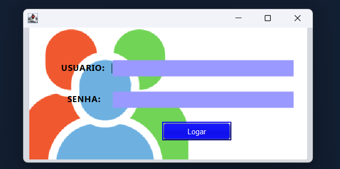

# CRUD JAVA - Cadastro de alunos
## Tela Inicial
Nesta tela, temos a solicitação de um úsuario e senha já cadastrados no banco de dados, para iniciar no sistema.

## Tela de Cadastro de Dados
Nesta tela pode ser inserido as informações do aluno que deseja cadastrar no sistema.
  - Button Limpar : Tem a função de limpar todos os campos após a digitação do usuário.
  - Button Visualizar lista de alunos : ao clicar neste button o usuário é encaminhado para a tela de registros.

## Tela de Visualização de Registros
Nesta tela visulizamos todos os registros salvos na nossa base de dados.
 Obs: Utilizei exemplos abstratos para teste.

## Tela de Visualização de Registros - Button Carregar Itens
Para que possamos alterar um registro, clicamos no registro desejado e usamos o button "Carregar Itens"  que carrega para os inputs, ao lado da tabela de registros, as informações do registro clicado. Conforme visualiza-se na imagem.
- Observações: a matrícula pode ser alterada, no entanto o ID deixei bloqueado, pois é utilizado para fazer a busca do registro no banco de dados e essa medida foi realizada para evitar erros.

## Tela de Visualização de Registros - Buttons Alterar e Deletar
Agora para confirmar a alteração realizada, precisa-se clicar no button "Alterar". 
  O button "Atulizar" tem a função de atualizar a tabela de registros após as alterações realizas. 
  Agora, digamos que deseja deletar um registro, para isso, seguimos o passo de clicar no registro desejado e para confirmar que deseja deletar clica-se no button "Deletar", a tabela de registros é atualizada automaticamente.

### Para saber mais detalhes do código pode utilizar o sumário abaixo, meu crud foi realizado com o pradão MVC.

## Sumário 
- [Pasta VIEW](./src/view/)
- [Pasta DTO](./src/DTO/)
- [Pasta DAO](./src/DAO/)
